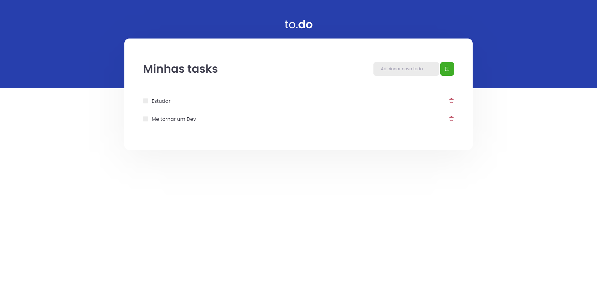

<h1 align="center">
    
</h1>

<br>

## 📝 TODO-LIST

Essa é uma aplicação onde o seu principal objetivo é uma pequena TODO List, treinando um pouco mais sobre manipulação de estado no React.

- Adicionar uma nova tarefa
- Remover uma tarefa
- Marcar e desmarcar uma tarefa como concluída


Esta aplicação foi construida, durante o curso IGNITE da RocketSeat.

## 🛠 Tecnologias

Esse projeto foi desenvolvido com as seguintes tecnologias:

- ReactJS
- Typescript
- Sass


## 🚀 Como executar

Clone o projeto e acesse a pasta do mesmo.

```bash
$ git clone git@github.com:luizsmatos/todo-list.git
$ cd todo-list
```

Para iniciá-lo, siga os passos abaixo:
```bash
# Instalar as dependências
$ yarn

# Iniciar o projeto
$ yarn dev
```

---
